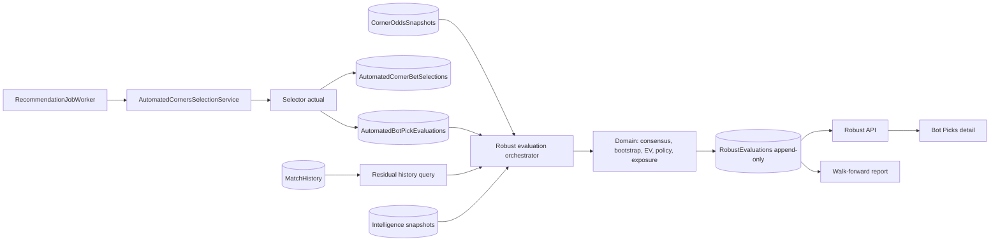
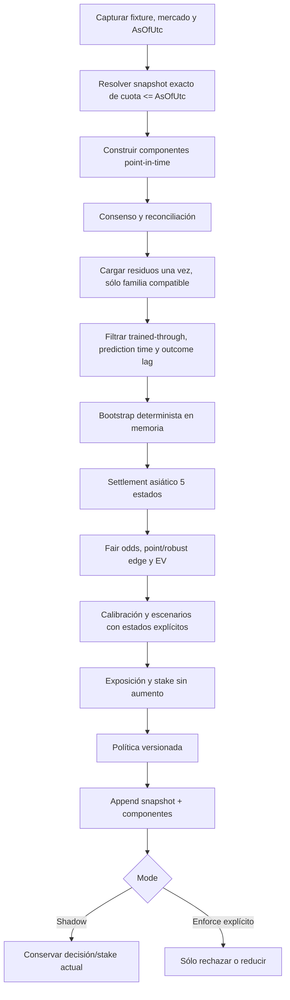

# Arquitectura

## Componentes

El job continúa llamando al pipeline existente. La capa robusta se conecta allí para observar el mismo candidato y el mismo cutoff; no es un job paralelo que pueda competir con la publicación.

## Pipeline de una evaluación

## Límites entre capas

- `Domain`: matemáticas puras, deterministas, sin SQL, reloj global ni red.
- `Application`: input/output estable, opciones, orquestación y contratos de repositorio.
- `Infrastructure`: Dapper/SQL Server, hashes canónicos, transacciones y consultas por lote.
- `API`: adapta candidatos reales, aplica timeout/cancellation y expone recursos.
- `Web`: carga el detalle robusto de forma lazy; el listado de Bot Picks no recibe payloads grandes.

## Persistencia

`dbo.AutomatedBotPickRobustEvaluations` guarda columnas consultables y JSON sólo para histogramas/evidencia variable. `dbo.AutomatedBotPickRobustComponents` conserva cada componente. `dbo.AutomatedBotRobustPolicies` conserva políticas versionadas. Las tablas existentes de candidatos, picks y odds se reutilizan.

Una evaluación repetida con idéntico input y versión devuelve la misma fila. Un cambio material crea una secuencia nueva, enlaza `SupersedesEvaluationId` y sólo cambia `IsCurrent` de la anterior de 1 a 0 dentro de la misma transacción.

## Reconciliación y fallback

Los pesos aprendidos sólo proceden de validación fuera de muestra y son proporcionales a `1 / max(error², epsilon)`, con cap por fuente. Si esa evidencia no existe, se usa un fallback explícito hacia Direct; contexto o escenarios sin validación nunca adquieren peso ocultamente.

## Integración con el sistema actual

En `Shadow`, `EffectiveDecision` y `EffectiveStake` siguen la decisión y stake actuales aunque `RobustDecision` sea Reject/ReduceStake/ManualReview. Esto permite medir desacuerdo sin cambiar resultados productivos. La liquidación sigue usando el motor canónico existente y la evaluación robusta jamás reescribe un settlement histórico.
